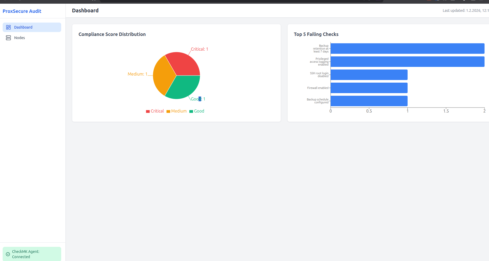
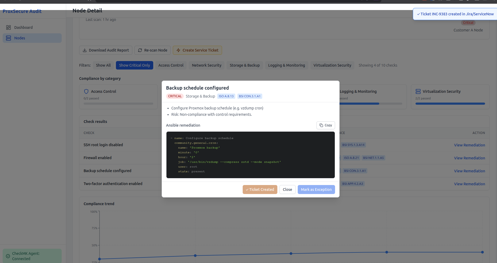
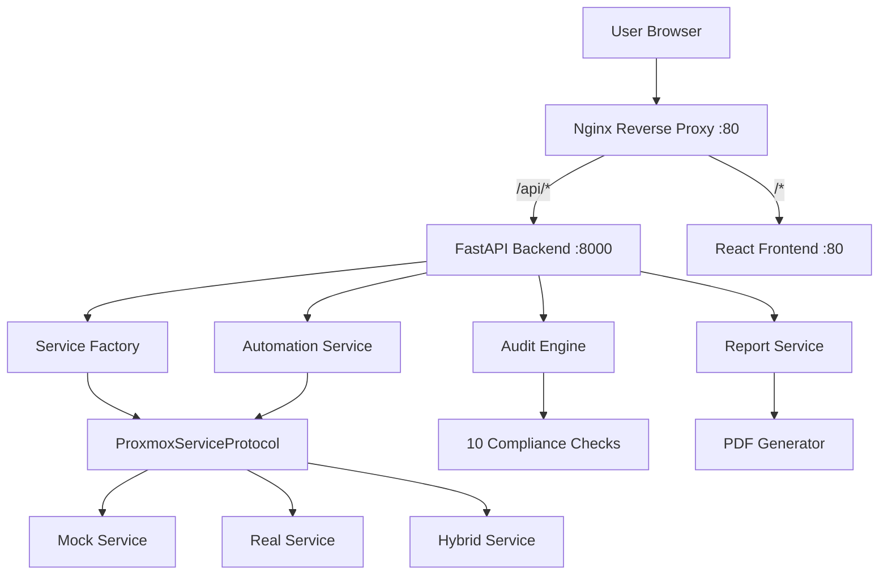
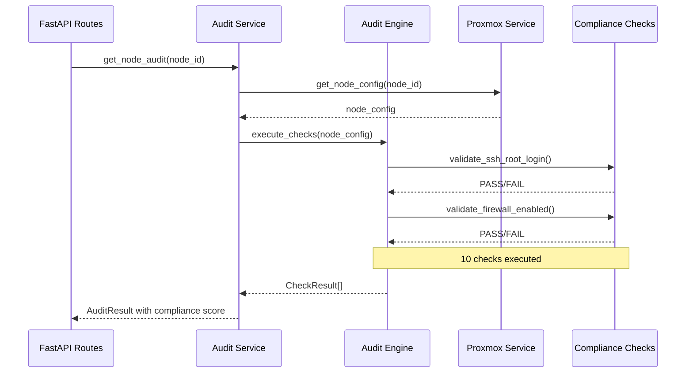
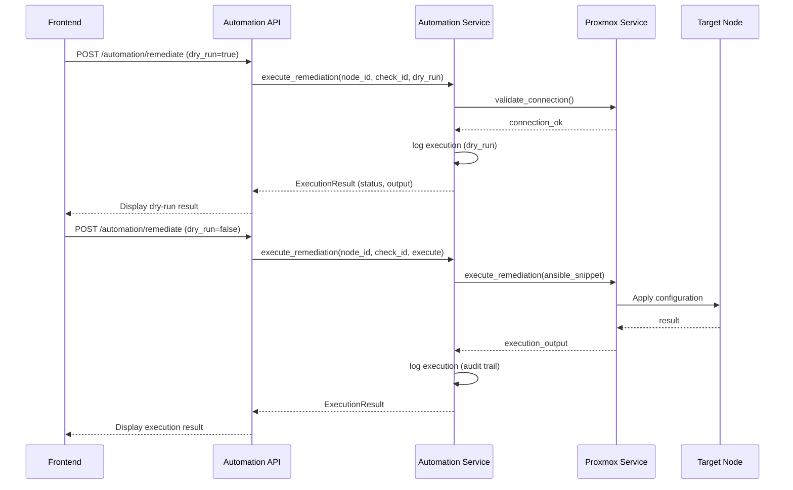
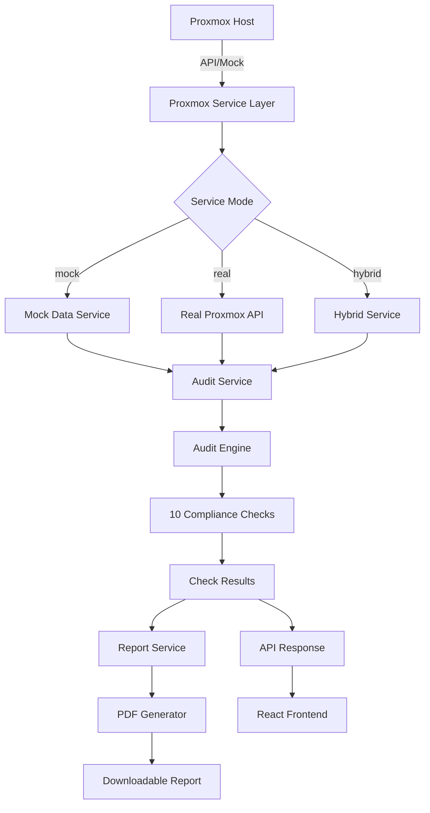
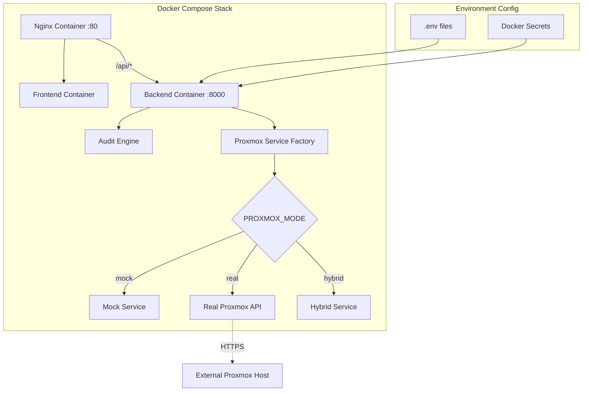
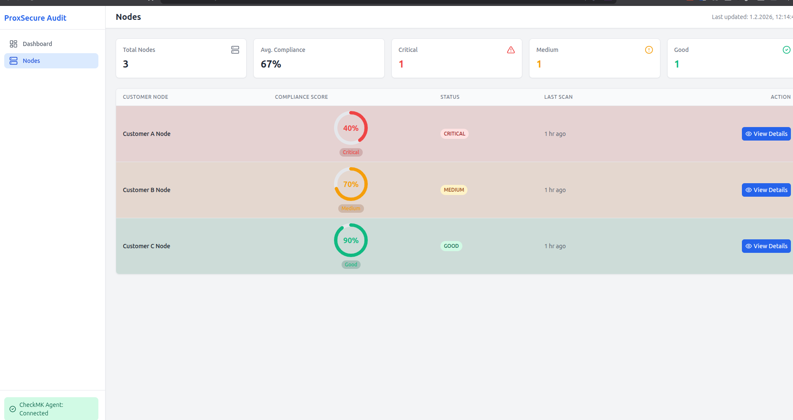
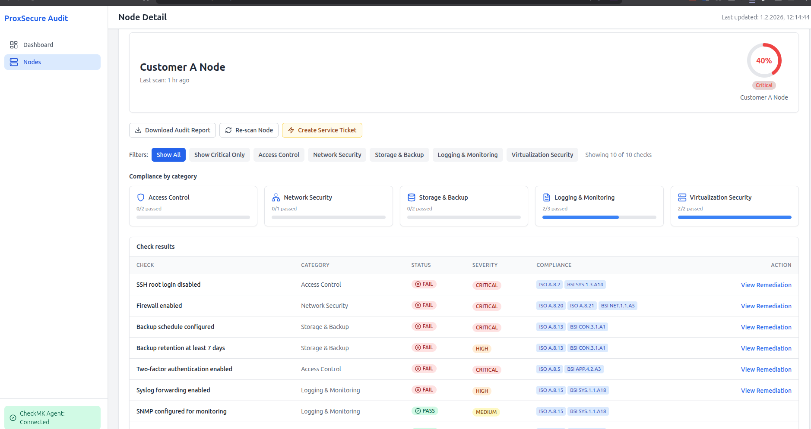

# ProxSecure Audit



## Table of Contents

1. [Project Overview](#1-project-overview)
2. [Hybrid Architecture](#2-hybrid-architecture)
3. [Automation Features](#3-automation-features)
4. [Business Value for MSPs](#4-business-value-for-msps)
5. [Architecture Diagram](#5-architecture-diagram)
6. [System Diagrams](#6-system-diagrams)
7. [Compliance Frameworks Explained](#7-compliance-frameworks-explained)
8. [Quick Start](#8-quick-start)
9. [Demo Workflow](#9-demo-workflow)
10. [API Documentation](#10-api-documentation)
11. [Development Guide](#11-development-guide)
12. [Technology Stack](#12-technology-stack)
13. [Roadmap (Future Enhancements)](#13-roadmap-future-enhancements)
14. [Project Structure](#14-project-structure)
15. [Security Considerations](#15-security-considerations)
16. [License & Contact](#16-license--contact)
17. [Contributing](#17-contributing)

---

## 1. Project Overview

ProxSecure Audit is a compliance automation platform for MSPs managing Proxmox infrastructure. It provides automated ISO 27001 and BSI IT-Grundschutz compliance mapping, a multi-customer fleet dashboard, Ansible-powered remediation guidance, and professional PDF audit reports.

**Key features:**

- Automated ISO 27001 + BSI IT-Grundschutz compliance mapping for every check
- Multi-customer fleet dashboard with triage-oriented compliance scores
- Ansible-powered remediation with copy-to-clipboard snippets for failed checks
- Professional PDF compliance reports for customer deliverables
- 30-day compliance trend charts per node
- Registry-pattern audit engine for extensible compliance checks
- **Hybrid architecture:** Mock, real Proxmox API, or hybrid (mixed nodes) via environment configuration
- **Automation:** Optional remediation execution (dry-run and execute) with audit trail

---

## 2. Hybrid Architecture

ProxSecure supports three Proxmox modes driven by `PROXMOX_MODE`:

- **mock** (default): Static mock data for development; no real Proxmox connection.
- **real**: Production mode; uses proxmoxer to connect to a real Proxmox host. Requires `PROXMOX_HOST`, `PROXMOX_USER`, and either `PROXMOX_PASSWORD` or `PROXMOX_TOKEN_NAME` + `PROXMOX_TOKEN_VALUE`.
- **hybrid**: Mixed nodes; some nodes use mock data, others use the real Proxmox API. Configure via `PROXMOX_HYBRID_CONFIG` (JSON map of node_id → `"mock"` or `"real"`).

A **ProxmoxServiceProtocol** abstraction allows mock, real, and hybrid implementations to be swapped without changing the audit engine. See `backend/app/services/proxmox_base.py`, `proxmox_mock.py`, `proxmox_real.py`, and `proxmox_hybrid.py`. Configuration is in `backend/app/core/config.py` and `backend/.env.example`.

---

## 3. Automation Features

When `AUTOMATION_ENABLED=true`, the API exposes:

- **POST /api/v1/automation/remediate** — Execute or dry-run remediation for a node/check (snippet resolved from audit).
- **GET /api/v1/automation/history/{node_id}** — Past remediation executions for a node.
- **GET /api/v1/automation/status** — Automation service status and configuration.

The frontend shows an "Execute Remediation" section in the remediation modal (dry-run and execute, with warnings for critical checks). See [AUTOMATION.md](AUTOMATION.md) for safety and usage.



---

## 4. Business Value for MSPs

- **Time savings:** Reduce manual audit time from hours to minutes per customer (e.g. from ~6 hours to ~30 minutes per customer with automation).
- **Revenue opportunities:** Compliance-as-a-Service model with monthly monitoring and quarterly reporting (reference Epic Brief calculations for pricing).
- **ROI example:** Significant revenue increase potential for MSPs with many customers (e.g. €225,500/year revenue increase for a 30-customer MSP as referenced in Epic Brief calculations).
- **Competitive differentiation:** Proxmox-specific checks, dual ISO/BSI mapping, and MSP multi-customer workflow out of the box.

---

## 5. Architecture Diagram



---

## 6. System Diagrams

### 6.1 Architecture Overview

The high-level architecture (see also Section 5) is shown below:


### 6.2 Audit Engine Flow



### 6.3 Automation Flow



### 6.4 Data Flow



### 6.5 Deployment Architecture



---

## 7. Compliance Frameworks Explained

- **ISO 27001:2022:** International information security standard. Each check maps to Annex A control references (e.g. A.8.2, A.8.13, A.8.20). All mappings verified against ISO 27001:2022 (updated from 2013 version).
- **BSI IT-Grundschutz:** German federal security framework (Edition 2023). Each check maps to module references (e.g. SYS.1.3.A14, NET.1.1.A5, CON.3.1.A1).
- **NIS2 Readiness:** Compliance checks align with NIS2 Directive Article 21 cybersecurity risk-management measures, demonstrating readiness for EU cybersecurity requirements.
- **Dual mapping:** Every compliance check in ProxSecure maps to both frameworks so MSPs can demonstrate coverage for international and German market requirements.

See [Compliance Mapping Checklist](docs/COMPLIANCE_MAPPING.md) for the full control mapping table and verification steps.

---

## 8. Quick Start

**Interactive deployment (recommended):**

```bash
git clone <repository-url>
cd Proxsecure
./deploy.sh
```

The script checks for Docker, asks for Mock or Real Proxmox mode, generates `backend/.env`, builds and starts the stack, and runs a health check.

**Or manual Docker Compose:**

```bash
docker-compose up --build
```

**Access points:**

- **Frontend:** http://localhost
- **API base:** http://localhost/api/v1
- **API documentation (Swagger):** http://localhost:8000/docs (when accessing backend directly on port 8000); via proxy use the same path if configured, or run backend separately for `/docs`)

Note: When using Docker Compose, the main entry is Nginx on port 80. The API is at `http://localhost/api/v1`. For interactive API docs at `/docs`, you may run the backend alone on port 8000 (see Development Guide).

---

## 9. Demo Workflow

1. **Dashboard:** View the fleet with 3 customer nodes (40%, 70%, 90% compliance).



2. **Drill-down:** Click Customer-A-Node (critical) to open the node detail view.



3. **Filtering:** Apply "Show Critical Only" to see critical-severity failed checks.
4. **Remediation:** Open the remediation modal for the "SSH root login disabled" check.
5. **Ansible:** Copy the Ansible snippet to the clipboard and paste into your playbook or terminal.
6. **PDF report:** Click "Download Audit Report" to generate and download the compliance PDF.
7. **Trend:** Scroll to the 30-day compliance trend chart for the node.

---

## 10. API Documentation

Interactive API documentation is generated by FastAPI. When the backend is running:

- **Swagger UI:** `http://localhost:8000/docs`
- **ReDoc:** `http://localhost:8000/redoc`

**Key endpoints:**

| Method | Endpoint | Description |
|--------|----------|-------------|
| GET | `/api/v1/health` | Health check |
| GET | `/api/v1/audit/nodes` | Fleet summary |
| GET | `/api/v1/audit/nodes/{node_id}` | Node audit detail |
| GET | `/api/v1/audit/nodes/{node_id}/history` | Compliance trend data |
| GET | `/api/v1/audit/nodes/{node_id}/report` | Download PDF audit report |
| GET | `/api/v1/health/proxmox` | Proxmox connection diagnostics |
| POST | `/api/v1/automation/remediate` | Execute or dry-run remediation |
| GET | `/api/v1/automation/history/{node_id}` | Remediation execution history |
| GET | `/api/v1/automation/status` | Automation service status |

**Environment variables** (see `backend/.env.example`): `PROXMOX_MODE`, `PROXMOX_HOST`, `PROXMOX_USER`, `PROXMOX_PASSWORD` or token, `PROXMOX_HYBRID_CONFIG`, `AUTOMATION_ENABLED`.

---

## 11. Development Guide

**Local development (hot reload):**

**Backend:**

```bash
cd backend
pip install -r requirements.txt
uvicorn main:app --reload --host 0.0.0.0 --port 8000
```

**Frontend:**

```bash
cd frontend
npm install
npm run dev
```

Configure the frontend to use the backend (e.g. `VITE_API_URL=http://localhost:8000/api/v1` in `frontend/.env.development`). Frontend dev server typically runs at http://localhost:5173.

---

## 12. Technology Stack

- **Backend:** Python 3.11, FastAPI, Pydantic, Pydantic-Settings, ReportLab, proxmoxer
- **Frontend:** React 18, Vite, Tailwind CSS, Recharts, Lucide React
- **Deployment:** Docker Compose, Nginx
- **Compliance:** ISO 27001:2022, BSI IT-Grundschutz

---

## 13. Roadmap (Future Enhancements)

- ~~Real Proxmox API integration (proxmoxer)~~ — Implemented (real/hybrid modes)
- ~~Automated remediation execution (dry-run + execute)~~ — Implemented (automation API + frontend)
- Database persistence (PostgreSQL) for audit history and execution trail
- User authentication & RBAC
- Real-time CheckMK monitoring integration
- Ansible Tower / AWX integration for remediation execution
- Multi-tenancy & customer portal
- Custom compliance framework support

---

## 14. Project Structure

```
Proxsecure/
├── backend/
│   ├── app/
│   │   ├── api/routes.py
│   │   ├── core/audit_engine.py
│   │   ├── services/
│   │   │   ├── audit_service.py
│   │   │   ├── automation_service.py
│   │   │   ├── proxmox_base.py
│   │   │   ├── proxmox_mock.py
│   │   │   ├── proxmox_real.py
│   │   │   ├── proxmox_hybrid.py
│   │   │   ├── proxmox_validator.py
│   │   │   └── report_service.py
│   │   ├── core/config.py
│   │   ├── models/check.py
│   │   └── data/mock_data.py
│   ├── Dockerfile
│   ├── main.py
│   └── requirements.txt
├── frontend/
│   ├── src/
│   │   ├── components/
│   │   ├── pages/
│   │   ├── hooks/
│   │   └── services/api.js
│   ├── Dockerfile
│   └── nginx.conf
├── docker-compose.yml
├── nginx.conf
└── README.md
```

---

## 15. Security Considerations

- **Credentials:** Never commit `.env` with real credentials; use Docker secrets or env injection in production.
- **API tokens:** Use dedicated Proxmox users with minimal permissions; prefer API tokens over passwords.
- **Automation:** Enable only when needed; use dry-run first; maintain audit trail of executions.

See [DEPLOYMENT.md](DEPLOYMENT.md) and [AUTOMATION.md](AUTOMATION.md) for deployment and automation best practices.

---

## 16. License & Contact

- **License:** See [LICENSE](LICENSE) in the repository root.
- **Changelog:** See [CHANGELOG.md](CHANGELOG.md) for release history.
- **Contributions:** Please open issues or pull requests for bugs and enhancements. See [Contributing](#17-contributing) below.

---

## 17. Contributing

We welcome contributions. Please follow these guidelines:

**Code style**

- Follow existing patterns in the codebase (e.g. `backend/app/core/audit_engine.py` for registry-style checks, type hints, and docstrings).
- Use consistent naming and structure; keep functions focused and tests alongside the code where applicable.

**Pull request process**

1. Open an issue or reference an existing one for non-trivial changes.
2. Fork the repository and create a branch from `main`.
3. Make your changes with clear commits; ensure tests pass and lint is clean.
4. Open a pull request with a description of the change and link to the issue.
5. Address review feedback; maintainers will merge when ready.

**Issue reporting**

- Use the [Bug report](.github/ISSUE_TEMPLATE/bug_report.md) or [Feature request](.github/ISSUE_TEMPLATE/feature_request.md) templates when opening issues.
- Provide steps to reproduce for bugs and context for feature requests.
